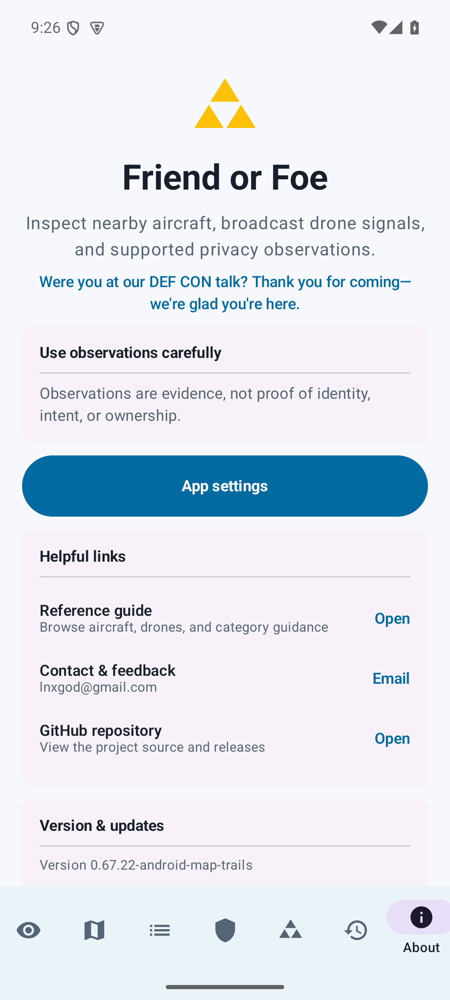
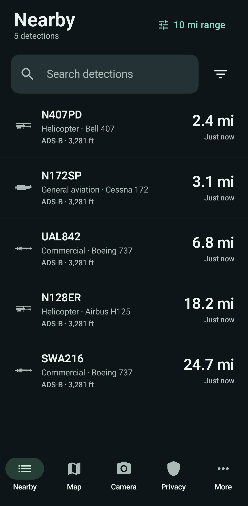
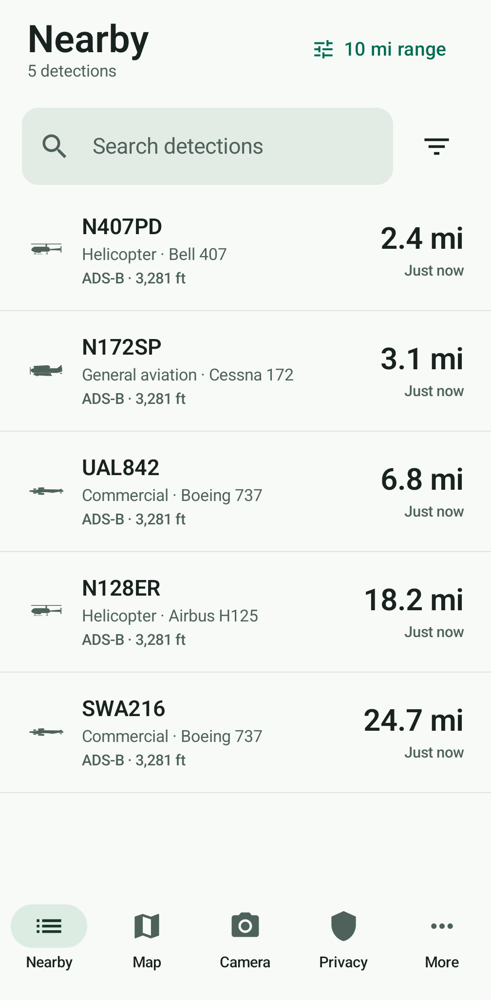
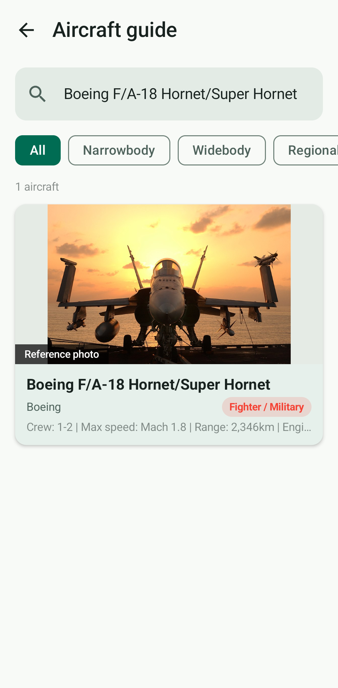
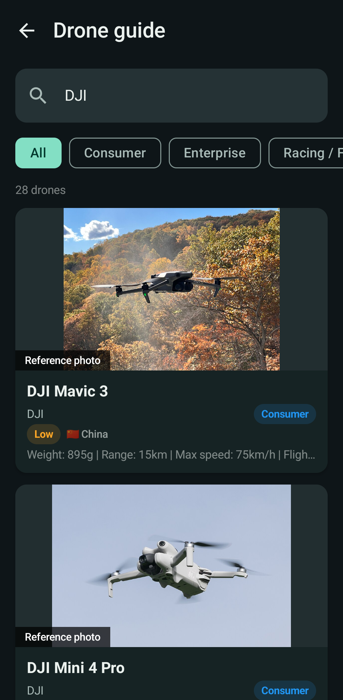
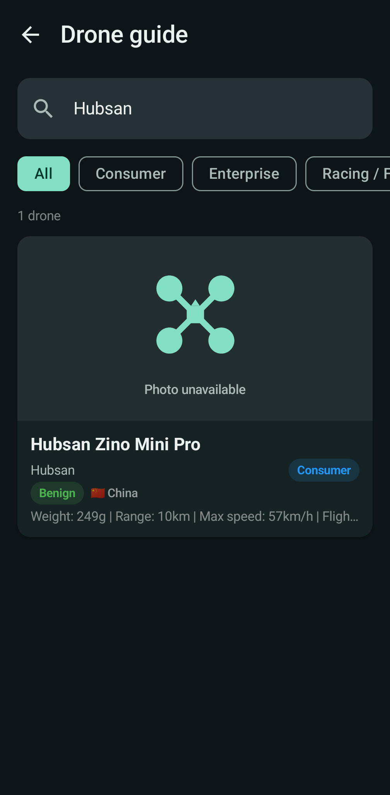

# Android interface simplification

## Review

Reviewed the launch flow, navigation, nearby list, map/trails, privacy findings,
settings, history and object details, including their state and permission models.
The backend and firmware supply observations; this change focuses on how the
Android app presents those observations.

- About is the launch destination; useful observations are several taps away.
- Seven bottom destinations crowd phones and labels disappear at larger text sizes.
- List rows repeat category, classification and source while distance is small.
- Opening a list row requires an intermediate sheet before actual details.
- Map trail controls and filter text consume the map's first viewport.
- Four source status rows precede privacy findings even when nothing needs action.
- Settings mix daily controls, connection diagnostics, reference material and credits.
- Existing details already distinguish live, stale and saved evidence; preserve this.

## Design

Visual thesis: a calm field instrument with charcoal or warm-white surfaces,
clear typography, a single sea-green action color, and restrained semantic alerts.

Content plan: observations first; five labeled destinations (Nearby, Map, Camera,
Privacy, More); distance leads each row; range is adjustable from Nearby; More
organizes settings, history, hardware and reference tools. Technical diagnostics
are disclosed on demand. Status, permissions and stale data remain truthful.

Interaction thesis: direct row-to-detail navigation; short tab fades rather than
sideways page motion; animated expansion for optional controls and source status.
Honor system animation settings and large text through Compose.

ImageGen supplies a visual concept for the Nearby workspace, not a bitmap UI.
The shipped interface uses native Compose text, controls, icons and live data.

The follow-up [image and icon audit](image-audit.md) covers every bundled photo,
image fallback behavior, incorrect reference associations, and map presentation.

## Acceptance

- Fresh and returning normal launches open the chosen primary workspace.
- Every existing destination remains reachable; secondary back returns correctly.
- Ten-mile priority and alert behavior stays intact, with a saved 1–50 mile control.
- Results have a clear name, type, distance and observation age; no fabricated data.
- Trail windows, fit, retry and recorded-path review remain available.
- Source failures and permissions remain visible and recoverable.
- Verify light/dark, large text, narrow phones, empty/loaded states and navigation
  using JVM tests, targeted emulator tests, screenshots, lint and APK builds.

## Visual reference

The [Nearby concept](nearby-concept.png) was generated with the built-in ImageGen
tool using this [saved prompt](imagegen-prompt.txt). It is a design reference;
sample aircraft in it are illustrative. Production screens use native controls
and existing vector aircraft silhouettes, with no generated interface bitmap.

## Review evidence

Screenshots are collected in `screenshots/`. Nearby screenshots use explicit test
fixtures to verify populated rows, including a distant helicopter. The fixture
data is confined to `androidTest`; it is not included in production behavior.

The regression suite exercises navigation, source recovery, settings, recorded
paths, large text, direct details, range changes and the existing permission gates.

## Validation

- `./gradlew testDebugUnitTest lintDebug assembleDebug assembleDebugAndroidTest --offline --console=plain` passed (1,130 JVM tests, no failures or skips).
- 67 API 35 emulator checks passed. After the final tab-layout fix, all 19 navigation,
  redesigned-workspace and permission checks passed again.
- All 20 follow-up image, reference-guide, detail, map/trail and workspace checks passed.
  Android decoded all 371 photos; all 13 silhouettes and category markers rendered,
  with no clipped marker edges at 0°, 45° or 90°.
- Screenshot fixtures cover light/dark Nearby, double text size, the More menu,
  actual reference guides, and failed-photo fallbacks.
- Real app walkthrough confirmed a 5-mile range survives restart, appears in
  settings, and resets to 10 miles. Live aircraft open details directly. History
  and Badge open from More and return with Back. One-hour trails and Fit trails
  display recorded paths. The map screenshot uses a synthetic San Diego location.
- Follow-up map walkthrough confirmed the neutral dark tiles load, live markers and
  recorded trails remain visible, and Fit trails works. Emulator crash buffer was empty.
- No changes to detection engines, backend, firmware, recorded-track persistence or
  the existing 10-mile alert/priority policy.

## Screenshots

The old landing screen appears first. The new Nearby examples use test fixtures.

| Previous home | Nearby, dark | Nearby, light |
| --- | --- | --- |
|  |  |  |

[Large text](screenshots/nearby-dark-large-text.png) · [More](screenshots/more-dark.png) ·
[Settings](screenshots/settings-dark.png) · [Map trails](screenshots/map-dark.png) ·
[Welcome](screenshots/welcome-dark.png)

| Aircraft guide, light | Drone guide, dark | Unavailable photo fallback |
| --- | --- | --- |
|  |  |  |

[Detail photo fallback](screenshots/detail-photo-fallback.png) shows the bundled
type reference after the primary image fails. These guide screenshots render the
real catalog and components; they do not substitute sample images.
