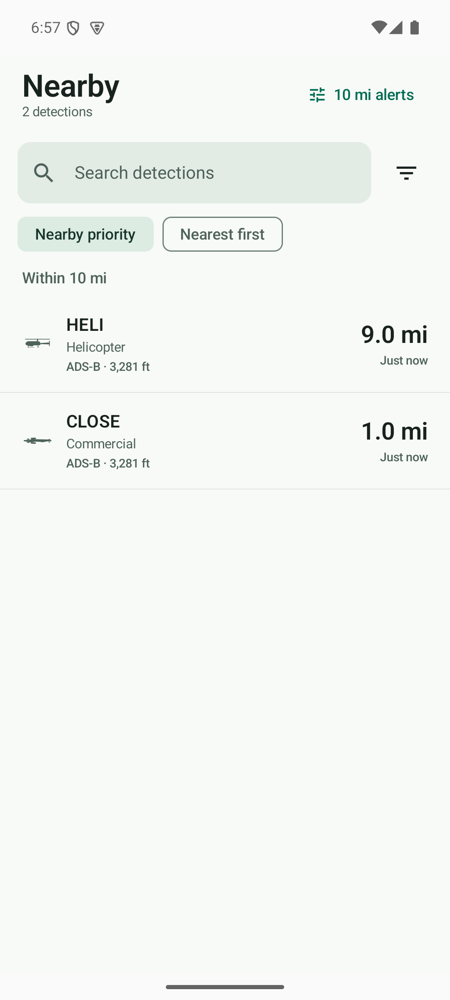
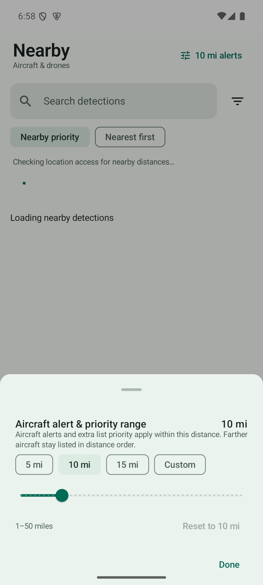
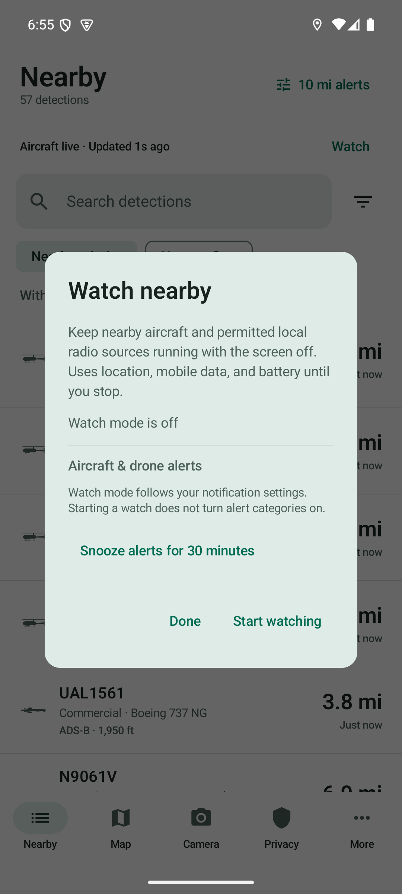
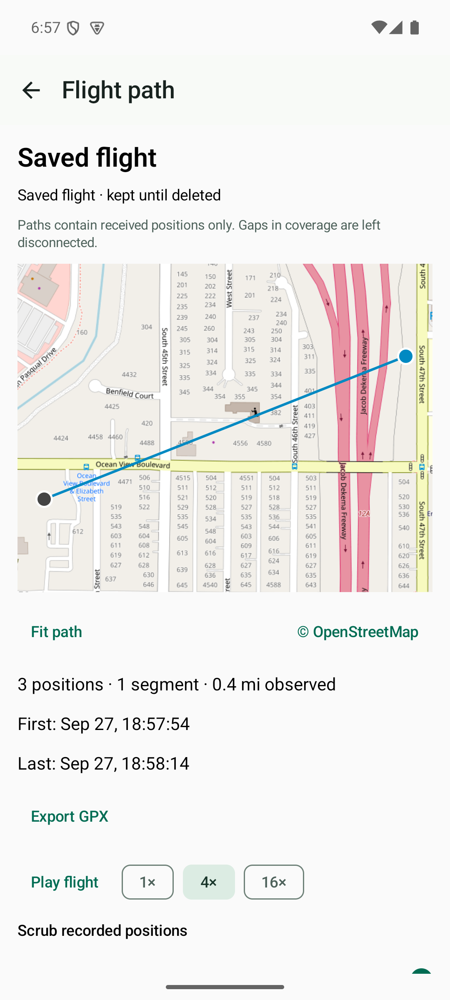
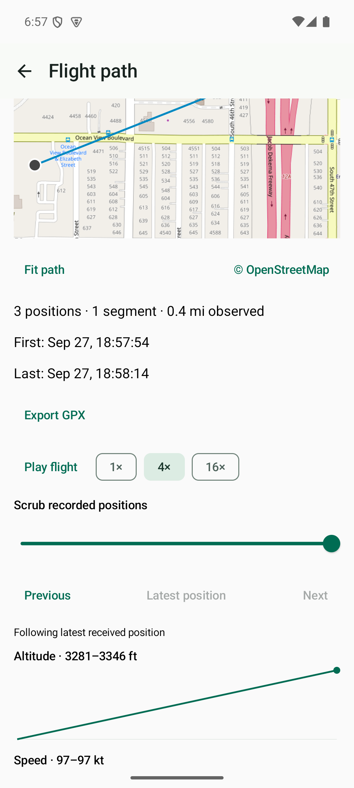

# Nearby and flight-review upgrades

Version: `0.67.24-android-nearby-watch` (132). Surfaces: Android and Android CI;
backend changes only validate the release workflow contract. ESP32 is unchanged.

## Behavior

- Nearby distinguishes waiting for location, connecting, live, reconnecting and
  offline. A failed feed does not masquerade as an empty sky. Older rows carry
  age labels; retry respects rate limiting. Aircraft feed disabled is shown as
  paused. Location recovery opens Android location settings.
- The alert radius remains 10 miles by default. Presets and custom 1–50 mile
  input share one preference. Priority applies inside that radius; farther
  aircraft have their own section. Nearest first is a persisted strict distance
  sort. Advanced range filters display miles, retaining their existing internal
  storage conversion.
- Notifications open the exact detected object, including encoded identifiers.
  Cooldown is recorded only after a permitted, successful notification post.
  Mute is per aircraft/drone; snooze lasts 30 minutes. Nearby → Watch exposes
  resume and unmute. These settings survive process restarts.
- Map details offer Follow this aircraft; touching the map or switching camera
  modes releases follow. Hidden/expired aircraft pause follow. Recorded paths
  support playback, scrubbing, altitude and speed charts, and GPX export.
  Only received positions are used; coverage gaps stay disconnected.
- Save this flight copies the current review window to More → Saved flights.
  Copies survive the 24-hour rolling cleanup. Clear History clears History and
  recent trails; saved copies require explicit deletion from Saved flights.
  Clearing app data or uninstalling removes all local data. Export writes only
  to the user-selected document destination.
- Watch is explicitly started while the app is visible, runs as a foreground
  location service, and has an ongoing notification with Stop watching. It does
  not enable alert categories or restart after boot. Alerting pauses without a
  location fix received in the last two minutes. Losing location or notification
  access stops the service with a recovery message. Existing local-radio
  permissions still apply.

## Verification

Local checks use JDK 17, Android SDK 35, and the disposable Pixel 8 API 35 emulator.

```
./android/gradlew -p android testDebugUnitTest lintDebug assembleDebug assembleDebugAndroidTest --offline --console=plain
adb shell am instrument -w -e class com.friendorfoe.FreshLaunchPermissionTest com.friendorfoe.test/androidx.test.runner.AndroidJUnitRunner
adb shell am instrument -w -e notClass com.friendorfoe.FreshLaunchPermissionTest com.friendorfoe.test/androidx.test.runner.AndroidJUnitRunner
```

Verified: 1,144 unit tests, lint, debug/test APK builds, 153 instrumented checks,
and six release-workflow contract checks passed.

Coverage includes 10-mile boundaries, sort persistence, custom range validation,
feed failure/recovery presentation, notification routing/cooldown, Room v6→v7
migration, saved-flight retention/deletion, GPX segment boundaries, playback,
service survival in background, and stopping through the notification action.

GitHub requires both the unit/lint/debug-build job and the API 35 emulator job
before it can access release signing credentials. Fresh-launch permission checks
run before tests that grant permissions. Emulator report artifacts upload even
on failure. The test-only Hilt entry point is compiled into debug builds only.

The emulator cannot validate physical BLE/Wi-Fi detection, OEM battery killing,
or long-running screen-off power use. Those require a real phone and signals.

## Screenshots

Nearby and flight screens use synthetic aircraft/recorded positions. The Watch
dialog was inspected in the running app; background rows come from the public
aircraft feed at the emulator location.






