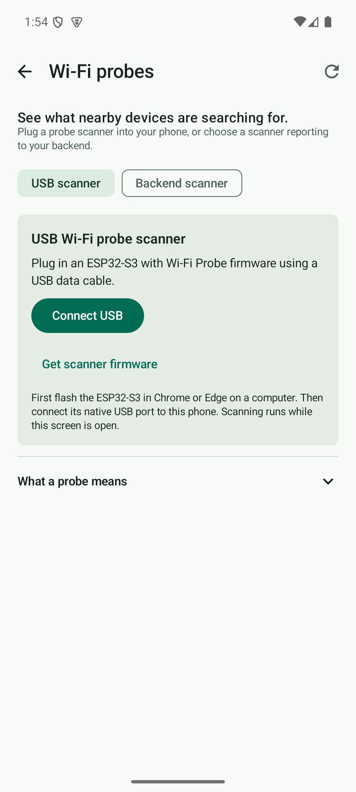
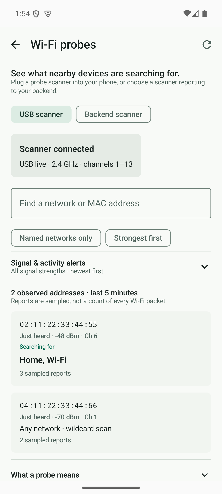

# Wi-Fi probe activity

Open **Privacy → Wi-Fi probes** or **More → Wi-Fi probes**. **USB scanner** is the default: flash a standalone ESP32-S3 with [USB Wi-Fi Probe firmware](../../../esp32/probe-scanner/README.md), connect its native USB port to the phone using a data cable/OTG adapter, and allow USB access. No backend or Wi-Fi setup is needed. The [web flasher](https://lnxgod.github.io/friendorfoe/#usb-probe) has a dedicated install option.

For a remote scanner, choose **Backend scanner**, enable **Sensor backend** in App settings, configure the backend URL, and select the scanner physically near you. These results belong to that scanner. Deploy the updated backend and combo scanner/uplink firmware together for complete sampled reporting. Older combo firmware omits ordinary directed requests and many wildcard requests.

Ordinary Android Wi-Fi scan results list access points and cannot supply other clients' probe requests. A full badge's existing USB threat feed is separate from the new standalone probe receiver.
The view shows observed transmitter MAC addresses, requested network names (SSIDs), explicit wildcard searches, current signal/channel, report age, and sampled report count in the last five minutes. Search by network or MAC, choose newest/strongest sorting, filter named searches, or set a minimum received signal of −80/−65 dBm. Signal strength is measured at the scanner, not a distance estimate. **Alert me here** provides vibration and a banner for new addresses or network names while this screen is open. It baselines the first poll and does not announce the same observation every five seconds. This is a foreground feature; it does not add background notifications.

Probe requests are ordinary network discovery, not proof of an attack or an established connection. A MAC can change, and multiple transmitters can share a capability fingerprint. The activity feed groups only by observed MAC within the selected scanner, without fingerprint-based identity inference. It does not record packet payloads or credentials.

## Implementation

- USB: dedicated passive S3 firmware, native TinyUSB CDC, versioned/boot-scoped newline JSON, heartbeat timeout and bounded receive queue. Android validates identity, frames fragmented UTF-8, bounds local history, clears on detach/reboot, and releases USB when the screen stops. The badge transport excludes this product so two readers cannot claim it.
- Android: dedicated Compose screen with lifecycle-gated five-second polling, scanner selection retained across recreation, search/filter controls, source changes that clear retained rows, retry/setup states, and monotonic aging even during outages.
- Backend: additive `GET /detections/probes/activity?sensor_id=…&max_age_s=300`. An unselected request returns the observer list with no transmitter rows. Projection uses scanner timestamps when synchronized, scopes signal and SSIDs before aggregation, and preserves exact primary names containing commas. Empty metadata is “name not captured” unless there is affirmative wildcard evidence.
- Scanner: validate SSID IEs and strip FCS before parsing; distinguish named, wildcard, and binary names. Ordinary probe telemetry is limited to three reports per second globally and one per MAC/name per 30 seconds, with queue pressure shedding. Existing priority observations retain their cadence. Probe telemetry bypasses LCD display filters but routine probes do not become badge threat alerts.
- Shared scanner/uplink deduplication: separate transmitter MACs and target names even when capability hashes match. Existing JSON protocol remains compatible.
- Capture remains limited to supported bands, the currently monitored channel, channel hopping, RF conditions, and sampling. No claim of exhaustive detection is made.

## Verification

Regression tests cover scope isolation, same-fingerprint transmitters, comma-containing SSIDs, wildcard versus missing names, invalid/malformed frames, delayed uploads, five-minute expiry, signal sorting/filtering, foreground lifecycle cancellation, source switching, initial alert baselines, dense-traffic budgets, and badge threat suppression. Emulator screenshots use synthetic observations, not real nearby devices.

A physical RF/USB capture was not performed. The standalone firmware compiles and its image identity, partition offsets, and Web Serial manifest are checked before packaging. Hardware acceptance: use a scanner beside your own test client, have it search for a known network, and confirm the exact SSID plus a separate general scan when the client sends one. Verify backend reporting and observer identity before interpreting an empty list.

Primary platform references: [Android Wi-Fi scan results](https://developer.android.com/develop/connectivity/wifi/wifi-scan), [ESP-IDF Wi-Fi capture metadata](https://docs.espressif.com/projects/esp-idf/en/v5.2.2/esp32s3/api-reference/network/esp_wifi.html).

## Verification artifacts

Android JVM tests cover USB framing, protocol validation, SSID preservation, wildcard/binary distinction, duplicate rejection, boot changes, heartbeat freshness, history limits, and lifecycle/source switching. Compose instrumentation covers USB setup and live synthetic observations as well as the backend flow. Firmware packaging tests reject missing binaries, incorrect application identity, and combo-scanner offsets.

## Emulator previews

