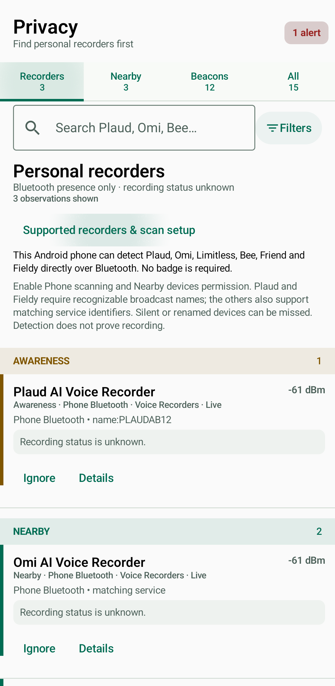
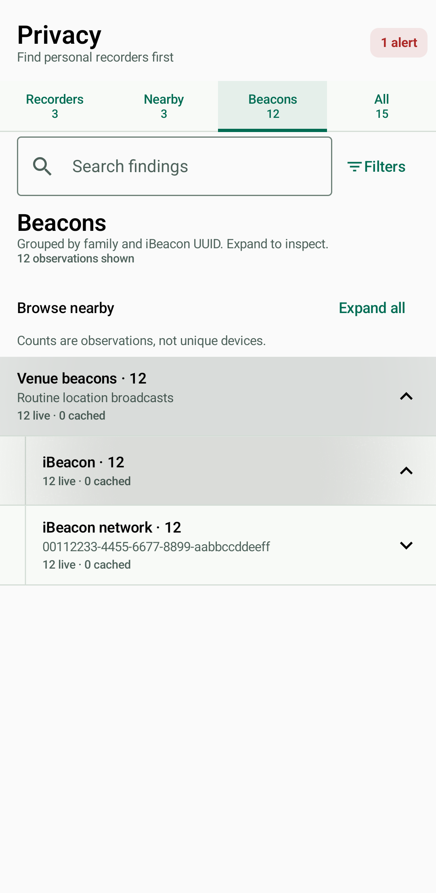

# Personal AI recorder detection

Android BLE scanning, ESP32 fingerprinting/badge awareness, and backend RF identity/privacy presentation recognize these families. Android uses the existing Voice Recorders category; the backend emits `VOICE_RECORDER` and `voice_recorder`. The badge shows `AI Recorder` in its listening-awareness category.

| Family | Name hint (case insensitive, at start) | Custom service UUID |
| --- | --- | --- |
| Plaud Note / Note Pro / NotePin | `PLAUD`, `NotePin` | None used alone |
| Omi and protocol-compatible devices | `omi` | `19b10000-e8f2-537e-4f6c-d104768a1214` |
| Limitless | `Limitless` | `632de001-604c-446b-a80f-7963e950f3fb` |
| Bee | `Bee` | `03d5d5c4-a86c-11ee-9d89-8f2089a49e7e` |
| Friend pendant | `friend_` | `1a3fd0e7-b1f3-ac9e-2e49-b647b2c4f8da` |
| Fieldy | `Fieldy` | None used alone |

Names must end after the listed token or continue with a space, hyphen, or underscore (the `friend_` prefix already includes its separator). `PLAUD` followed immediately by four alphanumeric serial-suffix characters is also recognized, consistent with the [Plaud interoperability protocol notes](https://github.com/naeemarsalan/opendict/blob/main/PLAUD_BLE_Protocol_Specification.md). Name-only evidence has confidence 0.75; custom service evidence has confidence 0.90. Service evidence wins over a conflicting recorder name. Firmware keeps existing tracker/drone/glasses classifications over name-only hints. These confidence scores are heuristic, not measured detection rates.

## Evidence and limits

Protocol values and discovery names were checked against Omi's [device protocol constants](https://github.com/BasedHardware/omi/blob/main/app/lib/services/devices/models.dart) and [native discovery implementation](https://github.com/BasedHardware/omi/blob/main/app/lib/services/devices/discovery/native_bluetooth_discoverer.dart) on 2026-10-05. Omi also documents [supported third-party devices](https://help.omi.me/en/articles/13153594-using-omi-with-third-party-devices). These are integration-source signatures; no physical recorder capture was available for this change.

The matcher deliberately narrows upstream name heuristics: `bee` anywhere would match Pebblebee; `pendant`, `compass`, and bare `friend` are too ambiguous. Plaud's `1910` service is a vendor protocol identifier, not proof of a Plaud product. Fieldy's `4fafc201-1fb5-459e-8fcc-c5c9c331914b` is also used by [Espressif’s generic BLE server example](https://github.com/espressif/arduino-esp32/blob/master/libraries/BLE/examples/Server/Server.ino). Neither is classified alone. No manufacturer company ID or MAC OUI is invented for these products.

Only advertised service lists or service-data UUIDs can be detected passively. A GATT service that is exposed only after connection is invisible to this scanner. Powered-off, radio-silent, connected/non-advertising, or renamed name-only devices can be missed. A protocol-compatible device may not be an original branded product (including Omi DIY hardware and Omi Glass). Names and advertisements can be spoofed. The recorder classification does not establish camera capability.

Presence does **not** establish active recording, audio content, uploading, wearer identity, or malicious intent. UI details explicitly leave recording status unknown. No connection, pairing, microphone access, or recording command is performed.

Other candidates for future capture-based signatures include HiDock/HiNotes, iFLYTEK, Mobvoi TicNote, soundcore Work, and Senstone. They are not classified by guessed names or shared chipset identifiers.

## Maintenance

Keep `PersonalRecorderSignatures.kt`, `personal_recorders.py`, and the recorder helpers in `ble_fingerprint.c` aligned. Tests cover all six families, custom UUID byte order, complete/incomplete/service-data advertisements, truncation, close UUID mismatches, ambiguous names and services, backend presentation, and badge awareness. Hardware validation should capture advertisements in pairing, idle, recording, and connected states before claiming model-specific coverage.

## Android browsing (v0.67.31)

The Privacy screen opens on Recorders, with persistent Recorders, Nearby, Beacons, and All tabs and observation counts. The selected tab survives saved-state recreation. Search, brand shortcuts (Plaud, Omi, Limitless, Bee, Friend, Fieldy), categories, sources, live-only, and attention-only filters refine that tab. Clearing filters stays in the tab; switching tabs clears refinements and returns to the top. Nearby hides routine beacon observations but keeps elevated beacon warnings. An alerts shortcut opens attention-only results across all categories. None of these controls disables scanning or changes alert rules.

When no recorders match, the page explains the detection limits rather than substituting beacons. The Recorders tab offers one-tap phone scan activation when Phone Bluetooth scanning is paused. Brand shortcuts use the same plain-language search as the text field; they are identification hints, not authenticated manufacturer identities.

Venue beacons expand into protocol families. Phone iBeacon detections retain their advertised UUID and group into network rows below the iBeacon family. Matching UUIDs label a broadcast network, not a unique physical device; expanding a network preserves each observation and its existing details/actions. Observations without UUID metadata remain accessible. Search includes UUIDs. Ordinary filter changes start collapsed; text searches expand matching branches.

The on-screen “Phone Bluetooth detects AI recorders” explanation lists supported families, permission/scanning requirements, name-only limits, and unknown recording status. Backend and badge recorder rows use the same Voice Recorders category.

Emulator screenshots use synthetic findings to demonstrate the UI, not physical-device detections:

